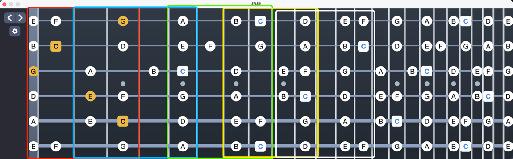
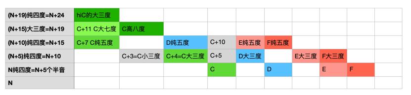
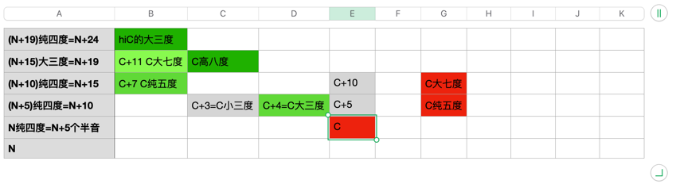

## 理解吉他指板
#### 最近练琴卡在90bpm的五声音阶爬格子，时过时不过的快没信心了，于是决定转头先梳理一下乐理。

在平常的音阶练习中，我的指板被分成了五块，每一块都按照起始音命名，按顺序为EGABD指型  

### 十二平均律 
```
C  C# D  D# E  F  F# G  G# A  A# B
```
###
``` 音程定义
数字含义为半音数量
1 小二度
2 大二度
3 小三度
4 大三度
5 纯四度
6 增四度/减五度
7 纯五度
8 小六度
9 大六度
10 小七度
11 大七度
12 纯八度

一度、四度、五度、八度 → 使用“纯、增、减”
二度、三度、六度、七度 → 使用“大、小”
```
#### 根据十二平均律和音程定义推导C和弦的指法如下： 
1. C和弦为大三和弦，构成音为根因，大三度，纯五度
2. 找到C的位置
3. 根据指板规律，C往上一根弦为C+5个半音
4. 往左移1品即得到C+4个半音，根据音程关系，4个半音=2个全音=大三度
5. C再往上一根弦为C+10个半音
6. 往左移3品得到C+7个半音，根据音程关系，7个半音=3个全音+1个半音=纯五度  
  
#### 根据推导过程可以得出一些结论： 
1. D/E/F... 等大三和弦可以直接平移C和弦的指法，这实际上就是变调夹原理
2. 上1左1为大三度，上1左1为小三度，2弦除外
3. 大三度+小三度=纯五度
4. 根音在5弦时，上3左3为大七度，这可能是2弦右移了一品的原因，不然手指按不过来七和弦
---

#### 在使用强力和弦的时候，由于不使用三度和弦，所以可以直接使用在上一弦上的纯五度音，即上2右2，再往上一品则是大七度音
#### 强力和弦的根音通常都在低音弦上（五六弦），一般不会到二弦，所以可以一直使用相同的指法
#### 和弦的色彩由三和弦决定，所以强力和弦是没有色彩的。

---
### 快速找到调内和弦
#### 这里只考虑自然大调音阶
在自然大调音阶中，音符总是以 '全全半全全全半' 音程排列
```
C调: C - D - E - F - G - A - B
D调: D - E - F# - G - A - B - C#
E调: E - F# - G# - A - B - C# - D# - E
F调: F - G - A - Bb - C - D - E - F
G调: G - A - B - C - D - E - F# - G
A调: A - B - C# - D - E - F# - G# - A
B调: B - C# - D# - E - F# - G# - A# - B
...
升降号的调暂不考虑
```
在熟练掌握了C大调各个和弦的按法时，假设此时要按出G大调的C和弦，那么
1. 先算出G大调中C和弦是几级： 8 - 5 + 1 = 4
2. 根据145大236小的口诀，得出4是大三和弦
3. G调的C和弦和C调的C和弦是一样的按法  

假设此时要按出E大调的C和弦，那么
1. 先算出G大调中C和弦是几级： 8 - 3 + 1 = 6
2. 根据145大236小的口诀，得出6是小三和弦
3. 那么在C调的C和弦基础上，把三音往左移一个品位即可，即食指左移一品。  

所以，和弦的按法实际只跟和弦大小（大三小三）有关系，只要记住每个和弦的大三/小三和弦按法，基本就能cover住自然大调内所有和弦。（讨厌的B和弦例外）
